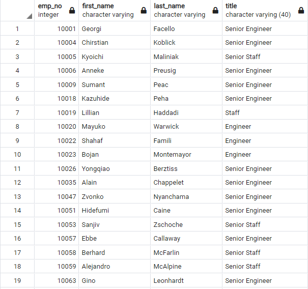
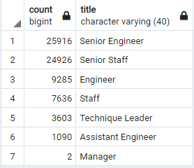
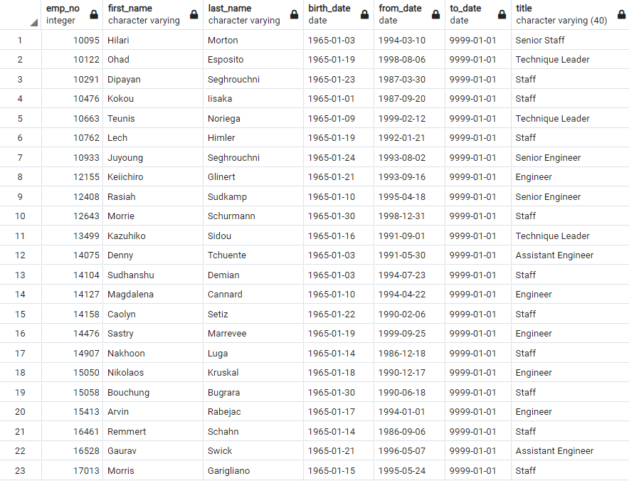

# Employee Database Built with PGAdmin and SQL

<div align="center">
    
</div>

## <div align="center">Build Employee Database with the Power of SQL and PGAdmin </div>

<p align="center">
<a href="#goals">Goals</a> &nbsp;&bull;&nbsp;
<a href="#dataset">Dataset</a> &nbsp;&bull;&nbsp;
<a href="#tools-used">Tools Used</a> &nbsp;&bull;&nbsp;
<a href="#results">Results</a> &nbsp;&bull;&nbsp;
<a href="#summary">Summary</a>
</p>

# <div align="center">Goals</div>

The department manager needs our assistance preparing for the “silver tsunami” as many current employees reach retirement age. Using the provided CSV files containing troves of employee data, we utilized the power of SQL and PGAdmin to process that data and produce additional CSV files with the specific data the manager needs. Our goal in this exercise is to parse through those large files and isolate the retirement age employees to answer important logistical questions for the human resources department.


# <div align="center">Dataset</div>

We will utilize the provided CSV files containing employee data to build our PostgreSQL Database and create new tables instructed by our analysis. These files were stored in an Amazon S3 server.

- [Departments:](data/departments.csv) 10 rows of data outlining every relevant department in CSV format
- [Department Employees:](data/dept_emp.csv) 331,604 rows of employee data by department in CSV format
- [Department Managers:](data/dept_manager.csv) 25 rows of data outlining every relevant department manager in CSV format
- [Employees:](data/employees.csv) 300,025 rows of employee data in CSV format
- [Salaries:](data/salaries.csv) 300,025 rows of employee salary data in CSV format
- [Titles:](data/titles.csv) 443,409 rows of employee position title data in CSV format


# <div align="center">Tools Used</div>
- **PostgreSQL:** Software used to build databases and analyze data with SQL
- **SQL:** Structured Query Language, used to query databases and quickly analyze structured data

# <div align="center">Results</div>

- Using the data from the Employees and Title tables, we joined them into a new table, then used the following SQL Query to remove the duplicate entries for Retirement age employees who had received promotions over the years. The DISTINCT ON () query enabled us to remove those duplicates, allowing us to gauge the true extent of the "silver tsunami" at 72,458 employees.
    ```sql
        SELECT DISTINCT ON (emp_no) emp_no,
            first_name,
            last_name,
            title
        INTO unique_titles
        FROM retirement_titles
        WHERE to_date = ('9999-01-01')
        ORDER BY emp_no, to_date DESC;

        SELECT * FROM unique_titles;
    ```
    

- Using the GROUP BY query in the code below, we generated a helpful breakdown of the count of titles within that retirement cohort. As you can see in the table below, Senior Engineer and Senior Staff equally accounted for about 70% of all the retirement age employees.
    ```sql
        SELECT count(title), title
        INTO retiring_titles
        FROM unique_titles
        GROUP BY title
        ORDER BY count(title) DESC;

        SELECT * FROM retiring_titles;
    ```
    

- Our efforts are also helping the company with spearheading the Employee Mentorship Program. The table below outlines a sample of Employees born in 1965 that qualify, a pool 1,549 valuable members of the organization.
- Engineers represented the largest group of employee titles eligible for the mentorship program, but the distribution is more balanced than the titles for the Retirement Age cohort. Engineer, Senior Engineer, Staff and Senior Staff accounted for 91% of the eligible mentorship pool.
 
    

# <div align="center">Summary</div>

- As the "silver tsunami" begins to make an impact, our analysis indicates that the company will need to fill 72,458 roles over the next couple of years.
- The company has 1,549 qualified, retirement-ready employees in the departments to mentor the next generation of employees. We believe this is not a sufficient number of mentors given the number of vacancies due to retirement.
- In order to account for this shortage, we recommend further analysis by building a query to determine the next oldest cohort of Senior Employees. This will allow the company to expand the Mentorship program to meet the higher than expected demand.
  - One way dig deeper into this pool is to generate a separate query using the GROUP BY to count the number of departments in this pool. This will help you see which departments have enough eligible mentors, and which departments will necessitate expanding the eligibility pool for. 

[Back to top](#employee-database-built-with-pgadmin-and-sql)


